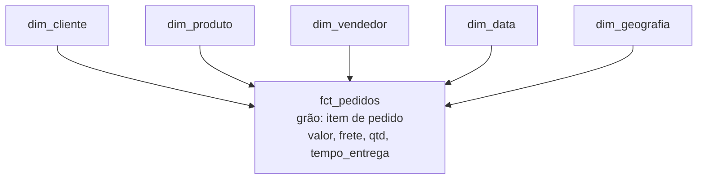

# Etapa 2 — Modelagem dimensional (o coração do DW)

> Semana ~2. Objetivo: um **modelo dimensional** desenhado e justificado, com o **grão** definido
> e ao menos uma dimensão como **SCD Tipo 2**. Errar aqui contamina todo o resto — invista tempo.

## 🎯 O que entregar nesta etapa
- Diagrama do star schema (mermaid no README).
- Grão da fato definido por escrito e justificado.
- Lista de dimensões e medidas, com tipos.
- Decisão de qual dimensão será SCD2 e por quê.

## 1. Os quatro passos de Kimball (revisão do M05)
1. **Processo de negócio:** venda de itens de pedido.
2. **Grão:** *uma linha por item de pedido* (`order_item`). É a decisão mais importante — permite
   analisar por produto, vendedor e categoria.
3. **Dimensões:** quem/o quê/quando/onde.
4. **Fatos:** as medidas numéricas.

## 2. Modelo mínimo (da especificação)
- **Fato:** `fct_pedidos` — grão de item de pedido. Medidas: `valor`, `frete`, `quantidade`,
  e (derivadas) `tempo_entrega_dias`.
- **Dimensões:** `dim_cliente`, `dim_produto`, `dim_vendedor`, `dim_data`, `dim_geografia`.
- Chaves substitutas (surrogate keys) nas dimensões; chaves estrangeiras na fato.

## 3. SCD Tipo 2 (histórico) — requisito
Escolha **uma** dimensão que muda no tempo e trate como **SCD2** (mantém histórico com
`valido_de`/`valido_ate`/`is_current`). Boas candidatas no Olist:
- `dim_produto` — categoria do produto muda.
- `dim_geografia` / `dim_vendedor` — localização muda.

No M07 você viu **snapshots do dbt**, que implementam SCD2 de forma declarativa — use-os.
Justifique no README **por que** essa dimensão precisa de histórico (ex.: "para atribuir a venda
à categoria vigente na data do pedido").

## 4. Erros a evitar
- **Pular o grão** e começar pelas tabelas → retrabalho.
- Colocar **medida em dimensão** (ex.: valor na dim_produto) ou **atributo descritivo no fato**.
- SCD2 "de enfeite" sem justificar a necessidade de histórico.
- Dimensão-lixo com dezenas de flags sem uso — mantenha o que responde às perguntas.

## ✅ Checklist de saída (Etapa 2)
- [ ] Diagrama do star schema no README.
- [ ] Grão da fato escrito e justificado.
- [ ] Dimensões e medidas listadas com tipos e chaves.
- [ ] Uma dimensão definida como SCD2, com justificativa.

## 🎤 Use a IA como banca
*"Meu grão é 'item de pedido'. Dadas minhas perguntas de negócio, esse grão as responde todas?
Alguma exige um grão diferente (ex.: um fato agregado por pedido ou por dia)?"*

---
**Revisado em:** 2026-08-30
