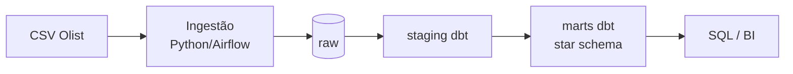

# dw-ecommerce — Data Warehouse analítico (TCC)

> **Scaffold do TCC.** Copie esta pasta para um novo repositório (`dw-ecommerce`), preencha os
> `TODO` e publique no GitHub. Esta é a estrutura mínima que a rubrica espera — veja o guia em
> `modulos/16-tcc-data-warehouse/` e a especificação em `tcc/especificacao-dw.md`.

## O quê
Data Warehouse dimensional para e-commerce (dataset **Olist**): ingestão → dbt → star schema,
orquestrado por Airflow e conteinerizado com Docker.

## Por quê (perguntas de negócio)
<!-- TODO: liste 3–5 perguntas que o DW responde. Ex.: -->
- Receita e nº de pedidos por mês, estado e categoria.
- Ticket médio e tempo médio de entrega por região.
- Taxa de reviews negativos por vendedor/categoria.

## Arquitetura

<!-- TODO: ajuste o diagrama ao seu desenho final (Etapa 2). -->

## Como rodar
```bash
# 1. Suba o stack (Postgres + Airflow)
docker compose up -d

# 2. Carregue os dados brutos (Olist CSV -> schema raw)
python ingestao/carregar_olist.py

# 3. Rode as transformações e os testes
cd dbt && dbt build

# 4. (opcional) Documentação + lineage
dbt docs generate && dbt docs serve
```
<!-- TODO: confirme que um terceiro consegue subir só com estes passos. -->

## Estrutura
```text
dw-ecommerce/
├── docker-compose.yml     # Postgres + Airflow
├── ingestao/              # CSV Olist -> raw (reproduzível, idempotente)
├── dbt/                   # staging -> marts (+ snapshots SCD2, testes, docs)
├── airflow/dags/          # DAG do pipeline fim a fim
├── docs/decisoes/         # ADRs (armazenamento, grão, SCD2...)
└── relatorio/             # relatório final (6–12 págs)
```

## O que aprendi
<!-- TODO: 1–2 parágrafos honestos: decisões, trade-offs, o que faria diferente. -->

---
Baseado no scaffold do curso (Especialização em Engenharia de Dados). **Revisado em:** 2026-08-30
